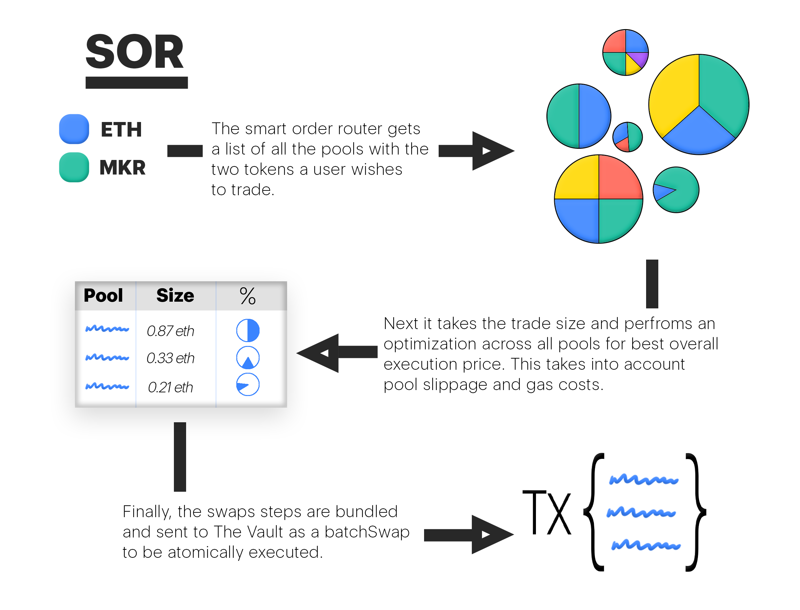

# 💰 Pool

## The Home of the Digital Market Index

The Home tab provides some information about the Digital Market Index.

The Digital Market Index is an index of 10 coins with the weight of each coin being based on its [Y+10 Marketcap as reported by Messari](#user-content-fn-1)[^1].&#x20;

There is also an 11th coin added to the index with a fixed weight of 10%: BUSD is a stablecoin linked 1-to-1 to the US Dollar and issued by Binance in partnership with New York-based Paxos.

The aim of the Digital Market Index is to provide investors with a transparent benchmark of the crypto space&#x20;

### Current information

You can see which coins are currently in the index and what weights have been assigned to each of those coins.&#x20;

<figure><figcaption></figcaption></figure>

### Time Machine

The first table shows a historical (simulated) view of the index composition, very single month since January 2018.

As the variety of [Balancer Pools](../products/broken-reference/) grows, the SOR grows too! The SOR keeps expanding as new pool types that use different math under the hood are added. This ensures that all pools in the Balancer ecosystem can support trades. By integrating with the SOR, any custom pool built on Balancer can benefit from all the other Balancer liquidity. All you need to integrate a pool is first and second order differentiable `spotPriceAfterSwap` functions (differentiable either numerically or analytically).

## Taking Gas Into Account

In an ideal world in which gas costs are negligible, a trade between two tokens would involve each Balancer pool that contains that pair. This would utilize all the available liquidity for the trader and maintain equal prices across all pools. Such a scenario would be an _arbitrage-free state_, in which no value could be extracted from the pools' price differences.

Since there _are_ incremental gas costs for each swap added to a batch, additional pools are added to the path only when they provide enough of a price difference to make up for the gas. Since only a subset of pools are considered, this can create arbitrage opportunities across Balancer pools.

## How It Works

The optimization mechanism finds the path through a set of Balancer Pools with the greatest output (after gas costs).

### Multiple Pools, Same Spot Price

In order to get the best price for a trader, the SOR is designed to create an arbitrage-free state between the paths it's using. In order to achieve this, **each path the SOR routes through needs to provide the same spot price after the swap has completed.**

.png>)

[^1]: The Y+10 Marketcap is the marketcap of the asset accounting for known issuance 10 years into the future. It is calculated by multiplying the current Price USD of the asset by its Y+10 Supply.
